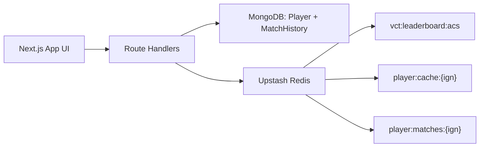

# VCT Live Analytics

A small Next.js dashboard for demonstrating a database system with a persistent MongoDB layer and a Redis speed layer. The app tracks VCT-style player profiles, filtered leaderboards, cache-backed player lookup, and recent match history.

## Features

- ACS leaderboard ranked with a Redis sorted set.
- Team, agent, and stat filters on the leaderboard.
- Player lookup with cache-aside Redis HASH storage.
- VLR.gg-derived match history/event names stored in MongoDB and cached per player in Redis.
- One-click seed endpoint for repeatable demos.

## Architecture



MongoDB is the source of truth for player profiles and match rows. Redis is used for the leaderboard ranking, short-lived player profile cache, and short-lived match history cache.

## Setup

1. Install dependencies.

   ```bash
   npm install
   ```

2. Create `.env.local` from `.env.local.example`.

   ```bash
   cp .env.local.example .env.local
   ```

3. Fill in the required values.

   ```env
   MONGO_URI=mongodb+srv://<user>:<password>@<cluster>/<database>?retryWrites=true&w=majority
   UPSTASH_REDIS_REST_URL=https://<region>-<id>.upstash.io
   UPSTASH_REDIS_REST_TOKEN=<token>
   ```

4. Start the development server.

   ```bash
   npm run dev
   ```

5. Open [http://localhost:3000](http://localhost:3000).

## Demo Flow

1. Click `Seed DB`.
   This clears and recreates the player and match-history demo dataset, then rebuilds the Redis ACS leaderboard.

2. Open `Leaderboard`.
   Show that Redis provides the ranked order while MongoDB supplies player profile details. Try filtering by team, agent, and sort stat.

3. Open `Player Lookup`.
   Search for `TenZ`, `aspas`, or `f0rsakeN`. The first lookup should come from MongoDB, and repeated lookups within 60 seconds should come from Redis.

4. Open `Match History`.
   Select a player and show recent matches, average ACS, win/loss record, and the ACS trend. The first history query reads MongoDB, then Redis caches the result for 60 seconds.

## API Routes

| Route | Method | Purpose |
| --- | --- | --- |
| `/api/seed` | `POST` | Seeds players, match history, and Redis leaderboard data. |
| `/api/leaderboard` | `GET` | Reads ranked IGN values from Redis ZSET and hydrates profiles from MongoDB. |
| `/api/player/[ign]` | `GET` | Reads a player by IGN using Redis cache-aside with MongoDB fallback. |
| `/api/player/[ign]/matches` | `GET` | Reads recent match history using Redis cache-aside with MongoDB fallback. |

## Useful Checks

```bash
npm run lint
npm run build
```

PowerShell API smoke checks:

```powershell
Invoke-RestMethod -Method Post http://localhost:3000/api/seed
Invoke-RestMethod http://localhost:3000/api/leaderboard
Invoke-RestMethod http://localhost:3000/api/player/TenZ
Invoke-RestMethod http://localhost:3000/api/player/TenZ/matches
```

## Notes

- This project uses Next.js 16 route handlers. Dynamic route `params` are promises, so handler implementations must `await params`.
- Redis TTLs are intentionally short for demos so cache hits and refresh behavior are easy to observe.
- Seeded event names, regions, dates, opponents, and source links are based on public VLR.gg pages. Per-player ACS/KDA rows are shaped as deterministic demo samples around each player's aggregate profile.
- Do not commit real database credentials or Redis tokens. Keep secrets in `.env.local`.
